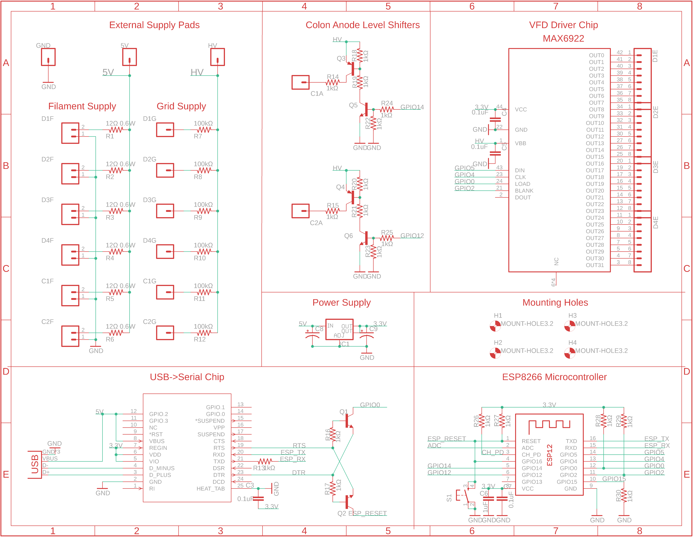
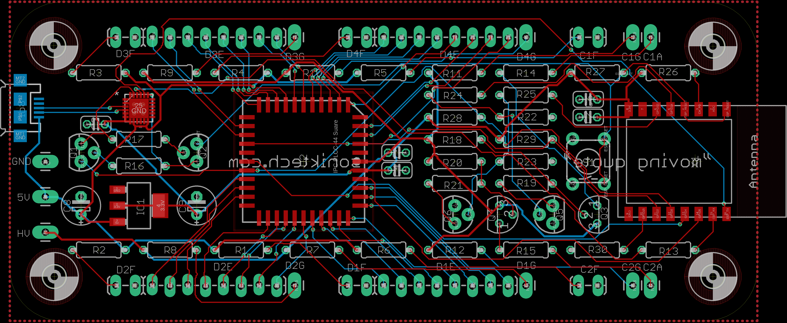

# large-vfd-clock
The largest VFDs I can get my hands on make a really nice clock!

The ILC1-1/8L was another interesting specimen I found while trawling ebay for strange displays.

4 of them with another VFD tube for the colon connect to a Wifi-enabled microcontroller for timekeeping.

